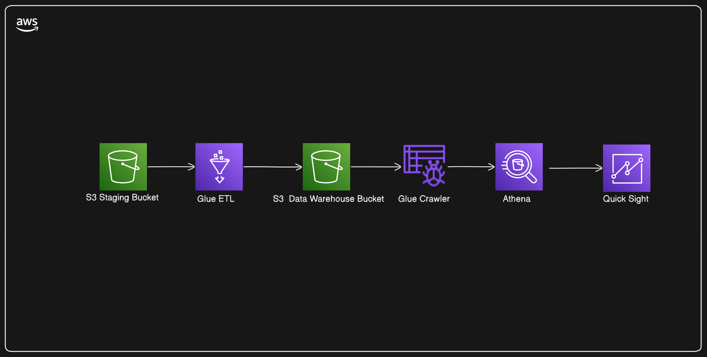

# DESCRIÇÃO
A Nuvem da AWS nos trás tecnologias para diversas industrias e campos. Uma que vem me chamando atenção é a area de dados, especialmente a de Engenharia de dados. Entre os serviços que se destacam temos o [AWS Glue](https://aws.amazon.com/pt/glue/). Ele é um serviço de integração de dados sem servidor, que torna possivel a preparação de dados de forma simples, pratica e barata em qualquer escala. Com ele é possivelconectar-se a mais de 70 fontes diferentes de dados, visualização, contrução e monitoramento de pipelines de [ETL](https://aws.amazon.com/pt/what-is/etl/).

Este projeto foi feito com o intuito de ajudar a exercitar fundamentos de Engenharia de dados utilizando-se dos serviços de engenharia de dados da nuvem da AWS. Nele foi contruido uma pipeline basica de ETL com ultilizando S3 para simular nosso armazenamento na [staging layer](https://kb.ufla.br/books/termos-e-definicoes-governanca-de-dados/page/staging-area)  e nossa [data warehouse](https://aws.amazon.com/pt/what-is/data-warehouse/). Glue construirá nossa pipeline e utilizaremos o mesmo para criar um [Glue Crawler](https://docs.aws.amazon.com/pt_br/glue/latest/dg/add-crawler.html) para popular um banco de dados no [Glue Catalog](https://docs.aws.amazon.com/pt_br/glue/latest/dg/start-data-catalog.html).
Posteriormente iremos usar o [AWS Athena](https://aws.amazon.com/pt/athena/) para realizar [Querys SQL](https://aws.amazon.com/pt/what-is/sql/) no nosso banco de dados do Glue Catalog. Por fim usaremos o [QuickSight](https://aws.amazon.com/pt/quicksight/) para construir visualizações dos nossos dados.
Como sempre estarei providenciando imagens para ajudar na compreender melhor cada passo e links utéis da documentação para ajudar a compreensão dos conceitos abordados.

# Arquitetura

# Technologias ultilizadas
- AWS Glue
- S3
- AWS Athena
- Amazon QuickSight
# Dataset

# S3 Staging Layer e Data warehouse
