# DESCRIÇÃO
A Nuvem da AWS nos trás tecnologias para diversas industrias e campos. Uma que vem me chamando atenção é a area de dados, especialmente a de Engenharia de dados. Entre os serviços que se destacam temos o [AWS Glue](https://aws.amazon.com/pt/glue/). Ele é um serviço de integração de dados sem servidor, que torna possivel a preparação de dados de forma simples, pratica e barata em qualquer escala. Com ele é possivelconectar-se a mais de 70 fontes diferentes de dados, visualização, contrução e monitoramento de pipelines de [ETL](https://aws.amazon.com/pt/what-is/etl/).

Este projeto foi feito com o intuito de ajudar a exercitar fundamentos de Engenharia de dados utilizando-se dos serviços de engenharia de dados da nuvem da AWS. Nele foi contruido uma pipeline basica de ETL com ultilizando S3 para simular nosso armazenamento na [staging layer](https://kb.ufla.br/books/termos-e-definicoes-governanca-de-dados/page/staging-area)  e nossa [data warehouse](https://aws.amazon.com/pt/what-is/data-warehouse/). Glue construirá nossa pipeline e utilizaremos o mesmo para criar um [Glue Crawler](https://docs.aws.amazon.com/pt_br/glue/latest/dg/add-crawler.html) para popular um banco de dados no [Glue Catalog](https://docs.aws.amazon.com/pt_br/glue/latest/dg/start-data-catalog.html).
Posteriormente iremos usar o [AWS Athena](https://aws.amazon.com/pt/athena/) para realizar [Querys SQL](https://aws.amazon.com/pt/what-is/sql/) no nosso banco de dados do Glue Catalog. Por fim usaremos o [QuickSight](https://aws.amazon.com/pt/quicksight/) para construir visualizações dos nossos dados.
Como sempre estarei providenciando imagens para ajudar na compreender melhor cada passo e links utéis da documentação para ajudar a compreensão dos conceitos abordados.

# Arquitetura

# Technologias ultilizadas
- AWS Glue
- S3
- AWS Athena
- Amazon QuickSight

# Dataset
O Dataset utilizado trata-se do [Spotify Dataset 2023](https://www.kaggle.com/datasets/tonygordonjr/spotify-dataset-2023) hospedado no [Kaggle](https://www.kaggle.com/), ele é um dataset bem rico que consiste de 5 arquivos CSV. Nele vamos encontrar dados sobre musicas(track), artistas(artists) e albums(albums). Os dados são brutos logo será necessario pre-processa-los para utiliza-lo. Neste repositorio deixarem os dados preprocessados para facilitar a replicabilidade do projeto. Nossos dados preprocessados consistem em 3 CSV files com nomes de albums, artits e track.

# S3 Staging Layer e Data warehouse
O primeiro passo a se fazer neste projeto é criar nosso sistema de armazenamento que simulara nossa area de staging e nossa data warehouse. Para isso vamos usar o Amazon S3.

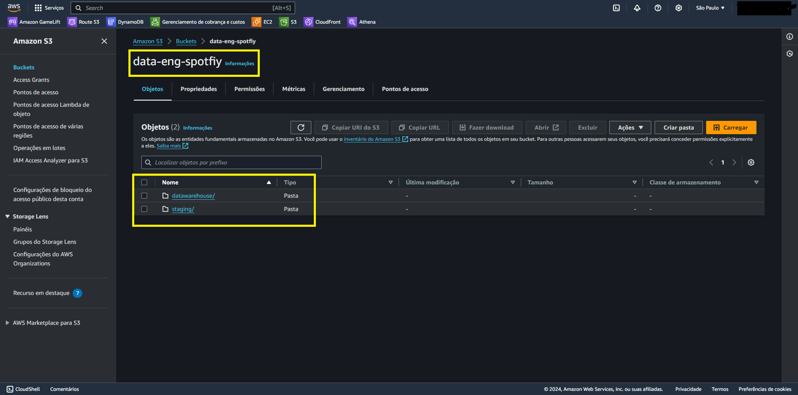

Aqui criamos um Bucket S3 com nome de *data-eng-spotfiy* e no mesmo vamos criar duas pastas uma que será nossa Stanging layer com nome *staging* e ou que sera nossa Data Warehouse com nome de *datawarehouse*.

Logo em seguida vamos fazer upload dos nossos arquivos preprocessados na nossa staging layer

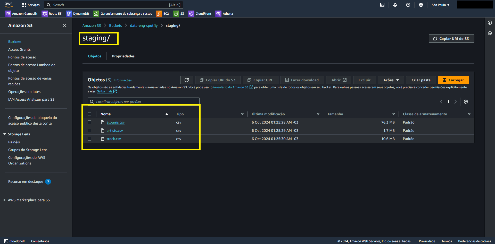

# Pipeline ETL com Glue
Aqui que vamos exercitar nossos conhecimentos de engenharia de dados construindo uma pipeline de ETL para transformar nossos dados e carregalos em nossa *datawarehouse*.
A transformação tera o objetivo de torna-los mais estruturados para posteriormente usa-los para popular um banco de dados no Glue Data Catalog
Glue é uma ferramenta poderosa que nos tras a capacidade de construir de forma simples uma pipeline de ETL por meio do seu AWS Glue Studio usando o [Visual ETL](https://docs.aws.amazon.com/glue/latest/dg/edit-nodes-chapter.html). Clicando nos campos indicados chegamos a construção do nosso primeiro Job.

 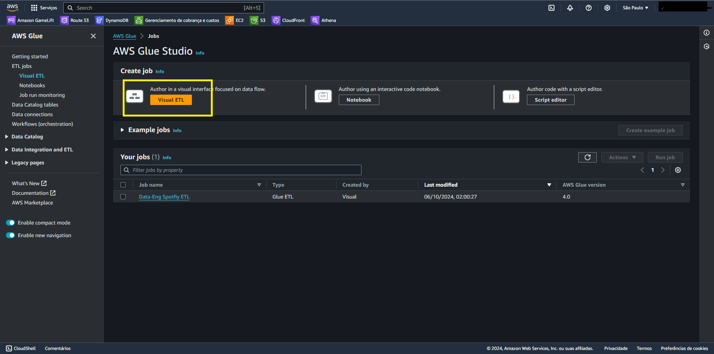

Aqui vamos começar adicionando 3 Nodes de Source. Que serão as nossas fontes de dados presentes na nossa *staging* layer, cada Node será um de nossos arquivos CSV. É interessante notar que Amazon S3 é apenas uma das possiveis fontes de dados que o Glue pode trabalhar. Temos fontes como Banco de dados relacionais, Apache Kafka e até mesmo Amazon Kinesis para trabalharmos com streaming de dados em tempo real.

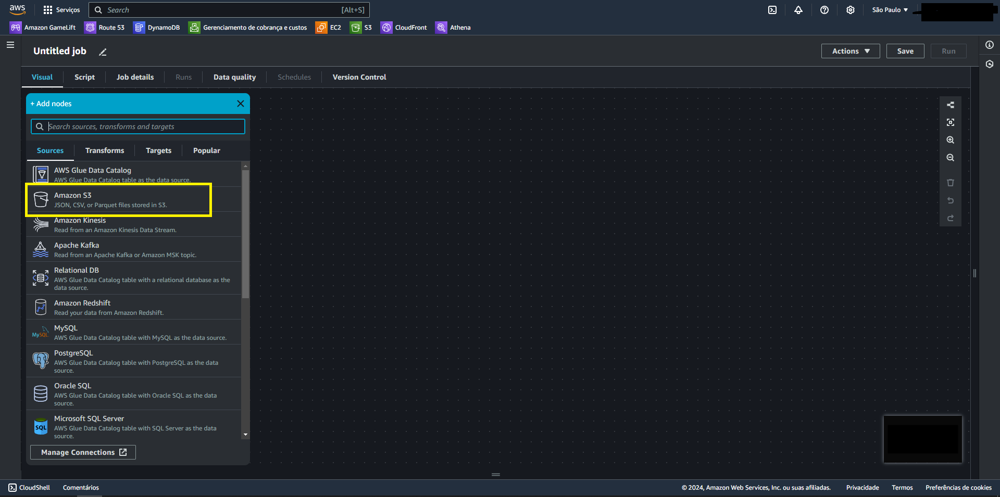

Agora com nossos nodes de fonte adicionados vamos configura-los indicando o seu nome, o caminho que estão armazenados no S3 atravez do S3 URL de cada arquivo e indicar o formato de cada um deles. O S3 URL de cada um deles pode ser encontrado acessando o objeto no Bucket S3 ou atravez do botão "*Browse S3" indicado no campo especificado.
Faremos isso para *artists*:

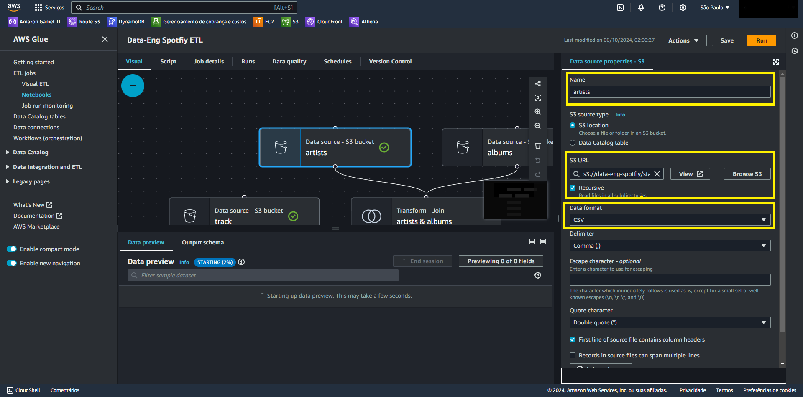

Para *albums*:

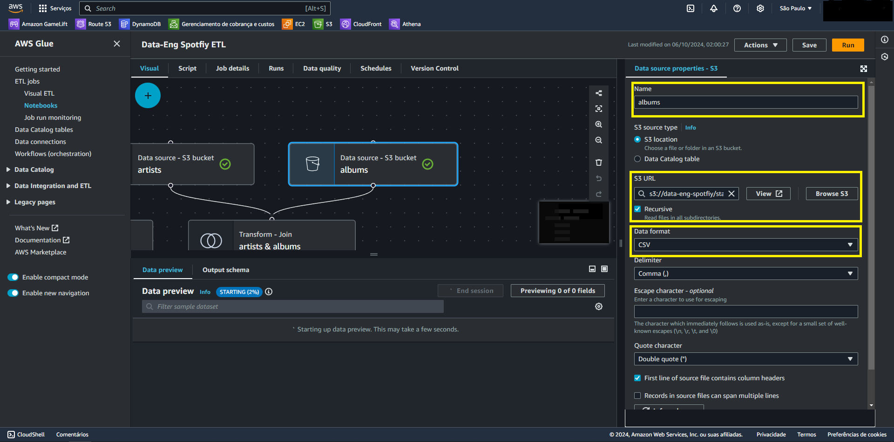

E finalmente para *track*:

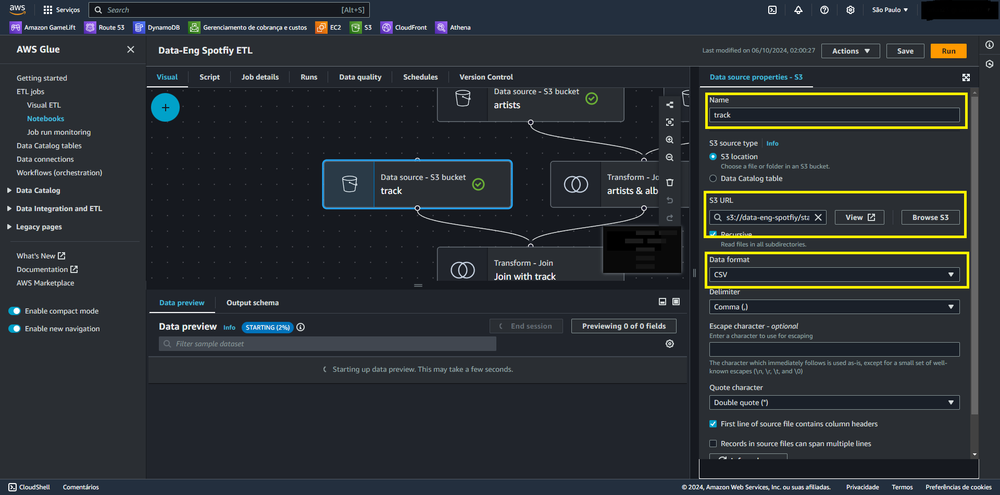

Agora com nossas Sources configuradas vamos realizar fazer um Node de transformação realizando um Join entre nossas fontes *artists* e *albums*

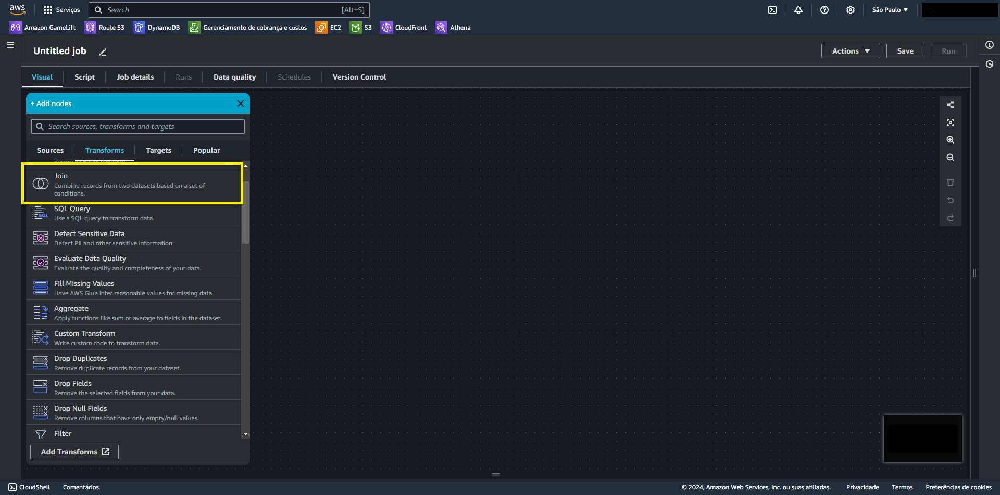

Para conectar nosso Join com nossas fontes pasta puxar uma linha do ponto presente no node da fonte até o mesmo ponto na parte superior do Join.
Vamos configurar o nome *artists & albums*, o tipo Inner join e join conditions que sera *id = artist_id*.

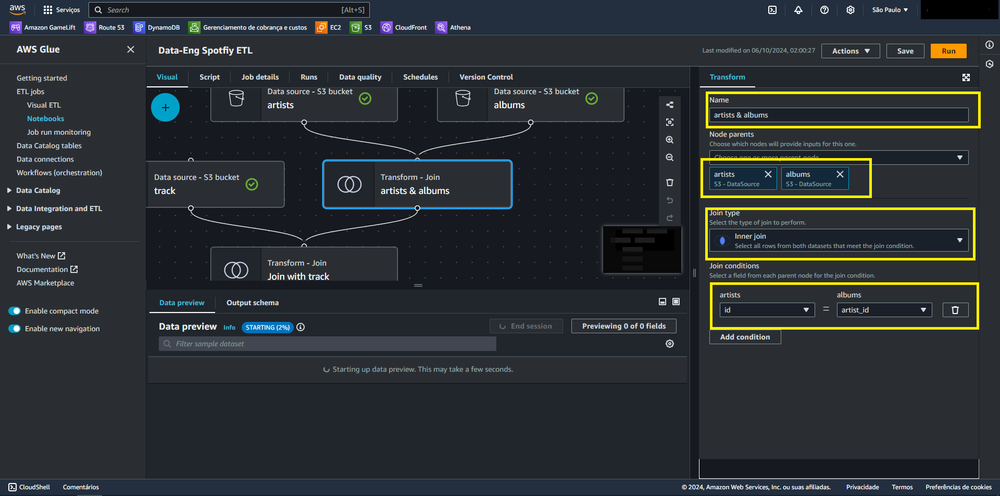

Com nosso join *artists & albums* pronto vamos realizar outra operação de join de mesmo tipo desta vez com nossa fonte track e nosso join *artists & albums* de nome *Join with track*. Aqui a join conditions será *track_id = track_id*

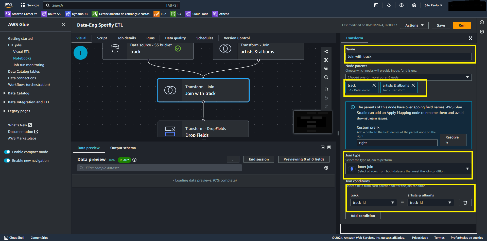

Com nossas Fontes conectadas atravez de nosso Nodes de Join, vamos realizar uma operação de Drop Fields para excluir campos desnecessarios ou duplicados. No nosso caso os campos .track id é duplicado com track_id e id é duplicado com artists_id.

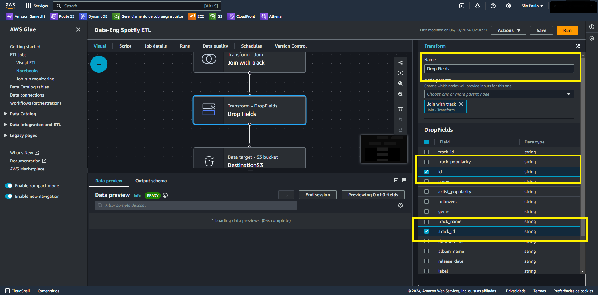

Após realizarmos todas as operações basta carregar nossos arquivos em um destino. Nossa *datawarehouse* criada no S3 será nosso alvo. Aqui será necessario definir nosso formato como parquet e compression type para snappy para Querys mais rapidas.

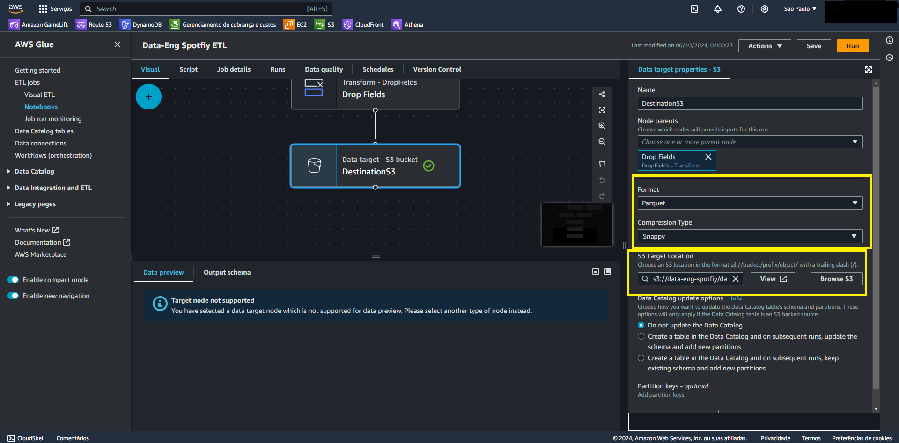

Assim vamos ter este resultado como nossa pipeline final:

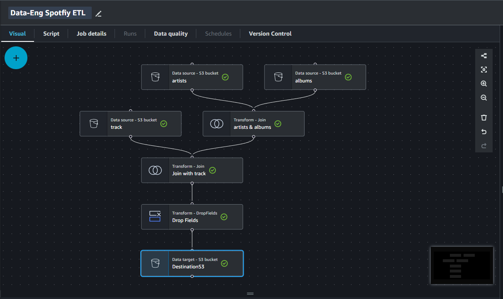

Na Aba Script podemos ver que um script foi gerado para realizar cada operação da nossa pipeline. Este sendo uma otima ferramenta para iniciantes na area de engenharia de dados para endenter melhor cada operação dispoviel no Visual ETL.

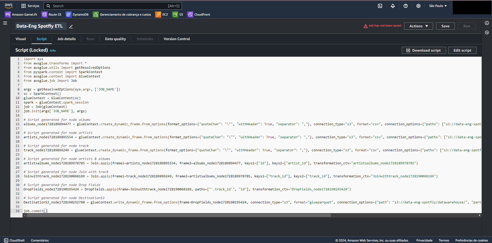

Depois de todas essas configurações chegou a hora de utilizarmos nossa pipeline! Mas antes precisamos de algo indipensavel: permissões. Para esta etapa do processo você pode criar uma role no IAM com apenas acesso ao S3 para que o Glue possa realizar as operações de ETL nos objetos armazenados no S3. Porém para garatir que os proximos passos do projeto sigam sem provlemas de permissões daremos todas as permições necessarias a essa role que são:

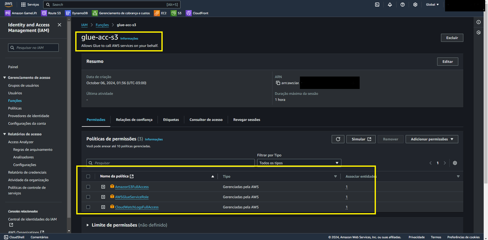

A nomearemos de *glue-acc-s3* e concederemos as politicas: *AmazonS3FullAccess*, *AWSGlueServiceRole*, *CloudWathLogsFullAccess*(esta será necessaria para usarmos o Crawler do Glue).

Porfim vamos acessar Job details e associar a IAM Role a nossa pipeline, usaremos Worker type G.1X e Request number of Workers vamos colocar para 5 por se tratar de um projeto simples de fonte de dados pequeno.

 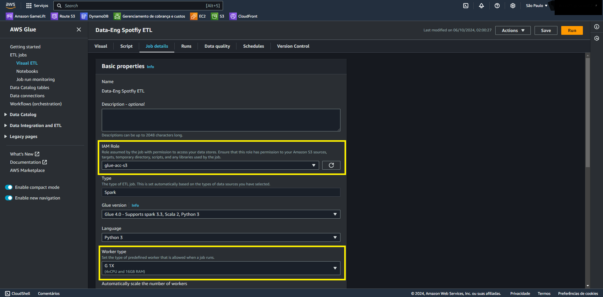 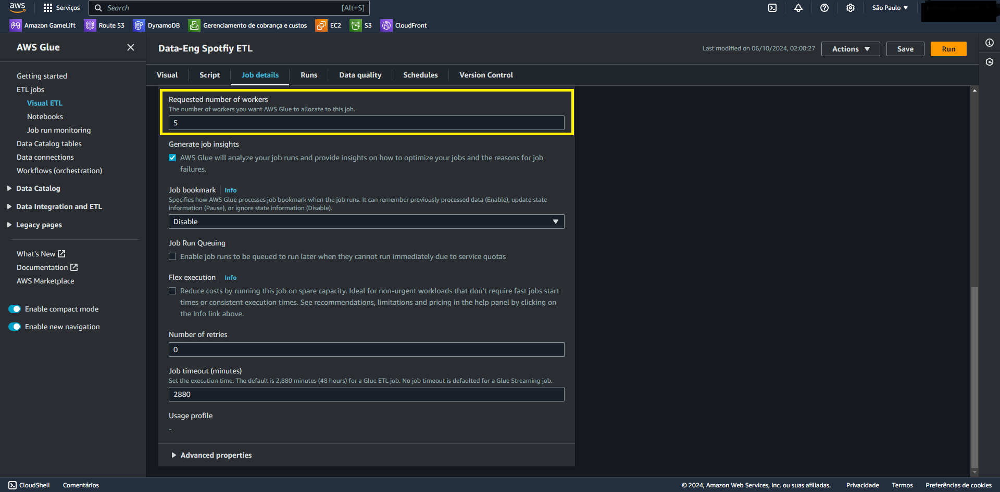
