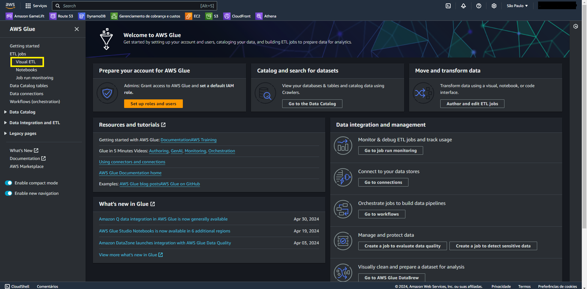
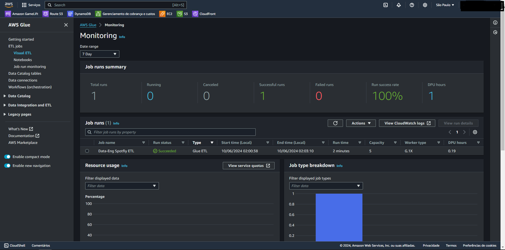

# DESCRIÇÃO
A Nuvem da AWS nos traz tecnologias para diversas indústrias e campos. Uma que vem me chamando atenção é a área de dados, especialmente a de Engenharia de Dados. Entre os serviços que se destacam temos o [AWS Glue](https://aws.amazon.com/pt/glue/), um serviço de integração de dados sem servidor, que torna possível a preparação de dados de forma simples, prática e barata em qualquer escala. Com ele, é possível conectar-se a mais de 70 fontes diferentes de dados, visualizar, construir e monitorar pipelines de [ETL](https://aws.amazon.com/pt/what-is/etl/).

Este projeto foi feito com o intuito de exercitar os fundamentos de Engenharia de Dados utilizando os serviços da AWS. Nele, foi construída uma pipeline básica de ETL, utilizando o S3 para simular nosso armazenamento na [staging layer](https://kb.ufla.br/books/termos-e-definicoes-governanca-de-dados/page/staging-area) e na nossa [data warehouse](https://aws.amazon.com/pt/what-is/data-warehouse/). O Glue será responsável por construir nossa pipeline e utilizaremos o mesmo para criar um [Glue Crawler](https://docs.aws.amazon.com/pt_br/glue/latest/dg/add-crawler.html) para popular uma database no [Glue Catalog](https://docs.aws.amazon.com/pt_br/glue/latest/dg/start-data-catalog.html).

Posteriormente, usaremos o [AWS Athena](https://aws.amazon.com/pt/athena/) para realizar [queries SQL](https://aws.amazon.com/pt/what-is/sql/) no nosso banco de dados do Glue Catalog. Por fim, utilizaremos o [QuickSight](https://aws.amazon.com/pt/quicksight/) para construir visualizações dos nossos dados. Estou providenciando imagens para auxiliar na compreensão de cada passo e links úteis da documentação para ajudar no entendimento dos conceitos abordados.

# Arquitetura

# Tecnologias utilizadas
- AWS Glue
- S3
- AWS Athena
- Amazon QuickSight

# Dataset
O dataset utilizado é o [Spotify Dataset 2023](https://www.kaggle.com/datasets/tonygordonjr/spotify-dataset-2023), hospedado no [Kaggle](https://www.kaggle.com/). Trata-se de um conjunto de dados bem rico que consiste em 5 arquivos CSV, contendo informações sobre músicas (track), artistas (artists) e álbuns (albums). Os dados são brutos, logo será necessário pré-processá-los para utilizá-los. Neste repositório, deixarei os dados pré-processados para facilitar a replicação do projeto. Nossos dados pré-processados consistem em 3 arquivos CSV, contendo nomes de álbuns, artistas e músicas.

# S3 Staging Layer e Data Warehouse
O primeiro passo neste projeto é criar nosso sistema de armazenamento, que simulará nossa área de staging e nossa data warehouse. Para isso, vamos usar o Amazon S3.

Criamos um bucket S3 com o nome de *data-eng-spotify*, e nele vamos criar duas pastas: uma será nossa staging layer, chamada *staging*, e a outra será nossa data warehouse, chamada *datawarehouse*.

Logo em seguida, faremos o upload dos nossos arquivos pré-processados na nossa staging layer.

# Pipeline ETL com Glue
Aqui exercitaremos nossos conhecimentos de Engenharia de Dados, construindo uma pipeline de ETL para transformar nossos dados e carregá-los na nossa *data warehouse*. A transformação terá o objetivo de torná-los mais estruturados para, posteriormente, popularem um banco de dados no Glue Data Catalog.

O Glue é uma ferramenta poderosa que nos traz a capacidade de construir de forma simples uma pipeline de ETL por meio do AWS Glue Studio, utilizando o [Visual ETL](https://docs.aws.amazon.com/glue/latest/dg/edit-nodes-chapter.html). Clicando nos campos indicados, chegamos à construção do nosso primeiro Job.

 

Vamos começar adicionando 3 nodes de Source, que serão as nossas fontes de dados presentes na nossa *staging layer*. Cada node será um de nossos arquivos CSV. É interessante notar que o Amazon S3 é apenas uma das possíveis fontes de dados com as quais o Glue pode trabalhar. Temos fontes como bancos de dados relacionais, Apache Kafka e até mesmo o Amazon Kinesis, para trabalhar com streaming de dados em tempo real.

Agora, com nossos nodes de fonte adicionados, vamos configurá-los, indicando seu nome, o caminho onde estão armazenados no S3 através do S3 URL de cada arquivo, e indicando o formato de cada um deles. O S3 URL de cada um pode ser encontrado acessando o objeto no Bucket S3 ou através do botão "*Browse S3*", indicado no campo especificado.

Faremos isso para *artists*:

Para *albums*:

E finalmente para *track*:

Agora, com nossas fontes configuradas, vamos realizar um node de transformação, realizando um Join entre as fontes *artists* e *albums*.

Para conectar nosso Join com nossas fontes, basta puxar uma linha do ponto presente no node da fonte até o mesmo ponto na parte superior do Join. Vamos configurar o nome como *artists & albums*, o tipo de Join será Inner join e a join condition será *id = artist_id*.

Com o join *artists & albums* pronto, realizaremos outra operação de Join, desta vez entre nossa fonte *track* e o join *artists & albums*, com o nome *Join with track*. A join condition será *track_id = track_id*.

Com nossas fontes conectadas através dos nossos nodes de Join, realizaremos uma operação de Drop Fields para excluir campos desnecessários ou duplicados. No nosso caso, os campos *track id* e *id* estão duplicados.

Após realizarmos todas as operações, basta carregar nossos arquivos em um destino. Nossa *data warehouse*, criada no S3, será o nosso alvo. Definiremos o formato como parquet e o tipo de compressão como snappy, para queries mais rápidas.

Nossa pipeline final ficará assim:

Na aba Script, podemos ver que um script foi gerado para realizar cada operação da nossa pipeline, sendo uma ótima ferramenta para iniciantes em Engenharia de Dados entenderem melhor cada operação disponível no Visual ETL.

Agora, para executar nossa pipeline, precisamos garantir as permissões. Você pode criar uma role no IAM com acesso ao S3 para que o Glue possa realizar as operações de ETL nos objetos armazenados no S3. Para garantir que os próximos passos do projeto sigam sem problemas de permissões, daremos todas as permissões necessárias à role, que serão:

Nomearemos a role como *glue-acc-s3* e concederemos as políticas: *AmazonS3FullAccess*, *AWSGlueServiceRole* e *CloudWatchLogsFullAccess* (necessária para o Glue Crawler).

Por fim, acessaremos os detalhes do Job e associaremos a IAM Role à nossa pipeline. Utilizaremos o tipo de Worker G.1X e o número de Workers será 5, já que o projeto é simples e a fonte de dados é pequena.

 

Com a pipeline pronta, basta clicar em Run, e ela executará as transformações nos dados e os armazenará na nossa *data warehouse*.

Além de permitir a criação da pipeline, o Glue também possibilita o monitoramento através de métricas. Ao clicar em Run para executar a pipeline, algumas métricas podem ser observadas dentro do próprio Glue.

  

# Usando um Glue Crawler para popular um banco de dados no Glue Catalog
Como resultado da nossa pipeline sendo executada nossos dados já transformados estarão em nossa *datawarehouse*. Com eles nesta área será necessario construir uma database no Glue Catalog estruturado em tabelas deles para assim conseguirmos utilzar Querys SQL nesses dados.
Neste Caso usaremos um crawler que criarar os meta-dados necessarios para popular a nossa database no Glue Catalog.

## Criando uma Database no Glue Catalog

Vamos acessar o Glue e, em seu painel de controle, acessar o Data Catalog na seção *databases*. Aqui, criaremos uma database com o nome de *spotify-project*. Nossa database estará vazia, mas logo em seguida, criaremos um crawler para populá-la.

Com nossa database criada, navegaremos até a seção de *crawlers* e adicionaremos um novo Crawler, escolhendo seu nome.

No próximo passo, escolhemos nossa *data source*, que será o *datawarehouse*, e marcamos que nossos dados ainda não estão mapeados com as tabelas do Glue.

Nas permissões de segurança, utilizaremos a mesma *role* já usada anteriormente. É importante notar que o Crawler exige permissões para escrever logs no CloudWatch Logs, então, se sua *role* não tiver essas permissões, seu Crawler não irá funcionar.

Para finalizar a criação do nosso Crawler, vamos adicionar uma database alvo, que no nosso caso será a *spotify-project*, e então criar nosso Crawler.

Depois de finalizar a configuração do Crawler, basta executá-lo para que ele popule a database automaticamente. Também é possível ver os detalhes da execução do nosso Crawler.

## Explorando o Glue Catalog

Agora, podemos ver o resultado do nosso Crawler na database, que criou uma tabela:

Acessando essa tabela, conseguimos visualizar todo o seu formato de saída e o schema, e também podemos editá-lo através do editor JSON.

Dessa forma, conseguimos popular dinamicamente uma database no Glue Catalog usando um Crawler. Esse banco de dados será crucial para a próxima etapa do projeto.

## Trabalhando com Queries SQL usando o Athena

SQL é uma ferramenta poderosa para consulta em bancos de dados relacionais. No entanto, nossos dados são objetos armazenados no Amazon S3. Para resolver esse problema, utilizaremos o AWS Athena, que é uma ferramenta de análise de dados e consultas que permite usar comandos SQL diretamente em um bucket S3 alvo. O Athena tem a capacidade de se integrar com diversos serviços da AWS, incluindo o Glue Catalog.

Acessando o painel do Athena, podemos navegar diretamente até o Editor de Consultas. Aqui, já é possível visualizar nossa database, que veio diretamente do Glue Catalog.

Antes de começarmos a usar o Athena, precisamos configurar um destino para os resultados de nossas consultas. Vamos em *configurações* e *gerenciar* para escolhermos o destino. Aqui, iremos criar um novo bucket para receber o output do Athena, chamado *athena-output-spotify*.

Agora, com o destino configurado, podemos executar uma Query SQL em nossa database. Vamos executar uma query simples e observar o resultado no bucket de destino.

Aqui está o resultado da nossa query. Vamos verificar o arquivo no bucket para checar se o resultado é consistente.

Indo até nosso bucket, podemos observar que ele cria subdiretórios com nomenclatura que indica a data da query.

Vamos pegar o primeiro item como exemplo.

Ao baixarmos o objeto e abrirmos, veremos o resultado exato da nossa query SQL.

Como podemos observar, o AWS Athena é uma poderosa ferramenta que pode ser utilizada junto com o S3 para realizar consultas escaláveis e segmentar os itens de interesse em uma grande quantidade de dados para o nosso caso de uso.

# QuickSight e BI

[BI](https://aws.amazon.com/pt/what-is/business-intelligence/) ou *Business Intelligence* é um assunto amplamente discutido em diversas indústrias. Com a crescente quantidade de dados que produzimos, temos a capacidade de analisá-los e obter insights valiosos sobre o nosso negócio.

Na perspectiva da AWS, o Amazon QuickSight é uma ferramenta de BI escalável na nuvem. Neste projeto, faremos uma pequena demonstração da aplicabilidade deste serviço usando nossos dados. A ideia é entender como o resultado da nossa *pipeline* pode ser utilizado para análise de dados e nos trazer grandes resultados com os dados corretos.

## Criando uma Conta no QuickSight e Dataset

Primeiro, vamos acessar a página do QuickSight através do console da AWS. Lá, criaremos nossa conta fornecendo os dados requisitados.

Aqui, também será necessário marcar a detecção automática em alguns serviços, no nosso caso, apenas S3 e Athena. Criar uma conta no QuickSight é gratuito, mas lembre-se de desmarcar os conteúdos adicionais para evitar custos extras!

Com nossa conta criada, essa será sua tela inicial.

O QuickSight nos traz algumas amostras de dados para entendermos melhor a plataforma. No entanto, neste projeto, usaremos o Athena para construir um *dataset* personalizado a partir dos nossos dados. Com esse *dataset*, será possível construir visualizações gráficas a partir dos nossos dados. Clique em *Datasets*.

Escolhemos nossa *data source*, que neste caso será o Athena, e iniciamos o processo de criação do nosso *dataset*.

Escolhemos o nome para o nosso *dataset* e, automaticamente, o QuickSight irá descobrir nossa tabela no Glue Catalog.

Selecionamos nossa tabela e deixamos o restante das configurações como padrão, bastando clicar em *visualize*.

Com o *dataset* criado e todos os itens populados, estamos prontos para analisar nossos dados e criar visualizações.

Este não é um projeto de análise de dados completo, mas mostramos aqui alguns gráficos construídos a partir dos nossos dados para ilustrar a eficiência de utilizar os dados transformados pela nossa *pipeline*.

## Track popularity by Name

## Album popularty by Name

## Track popularity by Name Horizontal Bar

# Conclusão
Neste projeto, implementamos uma pipeline de ETL utilizando o AWS Glue, transformamos dados, e os carregamos em uma data warehouse no Amazon S3. Em seguida, utilizamos o Glue Crawler para popular um banco de dados no Glue Catalog, realizamos consultas SQL no AWS Athena, e finalmente criamos visualizações com o Amazon QuickSight.

Este projeto reforçou a compreensão sobre os conceitos de Engenharia de Dados na AWS e mostrou como construir soluções de ETL de forma prática e eficiente usando os serviços da AWS.
